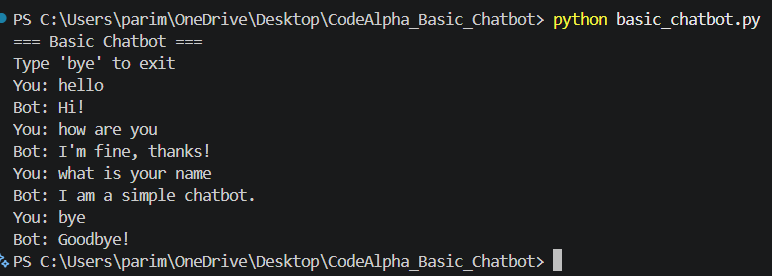

# 🤖 CodeAlpha Basic Chatbot

## 📌 Project Overview

This project is a simple rule-based chatbot developed using Python. The chatbot interacts with users by responding to predefined inputs using conditional statements and loops.

## ✨ Features

- Greets users
- Responds to common questions
- Handles unknown inputs
- Allows users to exit the conversation using "bye"
- Beginner-friendly Python project

## 🛠️ Technologies Used

- Python
- If-Else Statements
- While Loop
- String Handling

## 🚀 How to Run

```bash
python basic_chatbot.py
```

## 💬 Sample Output



## 📂 Project Structure

```text
CodeAlpha_Basic_Chatbot
│
├── README.md
├── basic_chatbot.py
└── chatbot_output.png
```

## 🎯 Learning Outcomes

- User Input Handling
- Conditional Logic
- Loops in Python
- Building a Simple Chatbot

## 🏆 Internship Task

This project was completed as part of the CodeAlpha Python Programming Internship.
